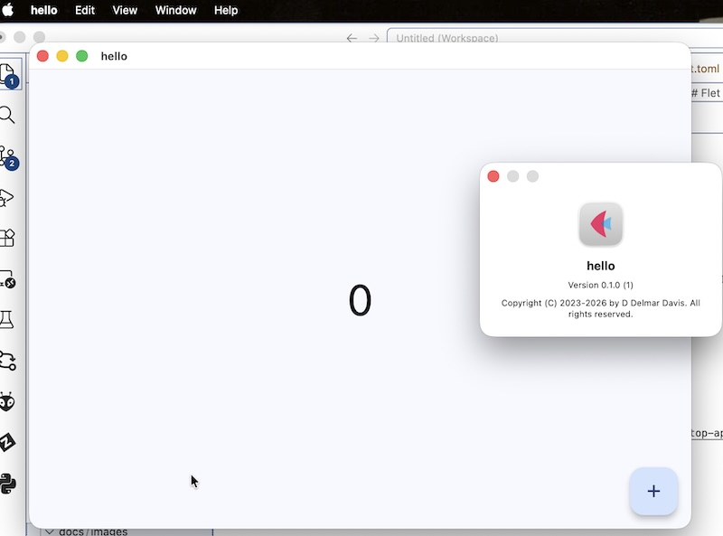
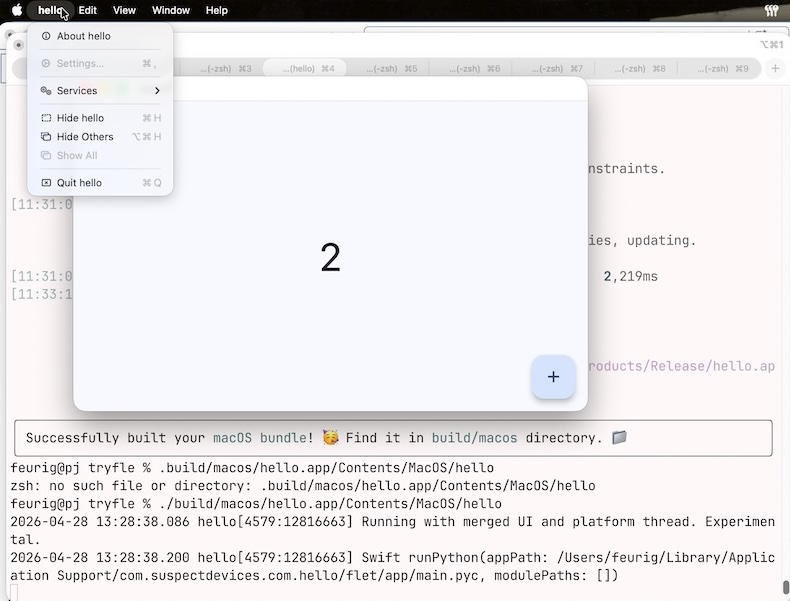
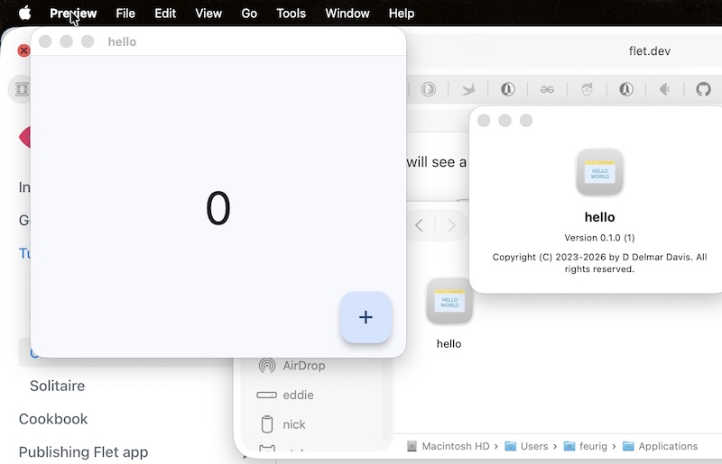
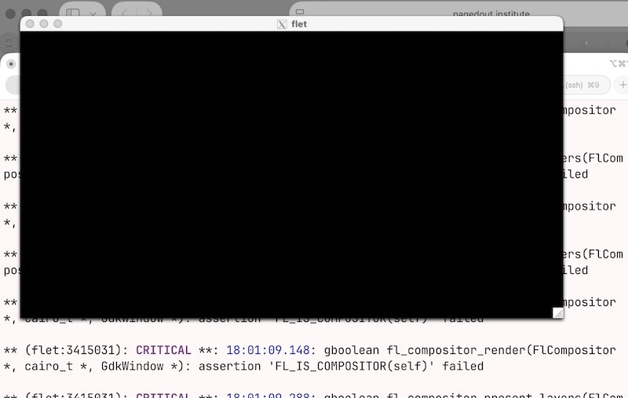
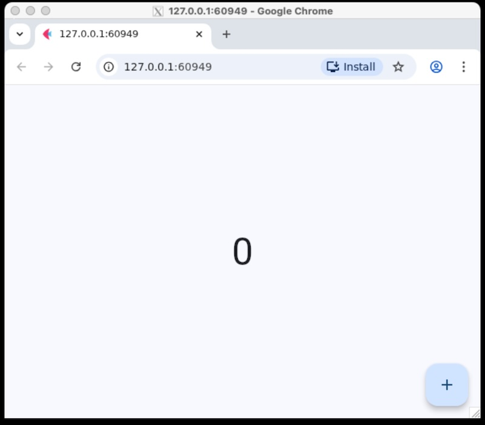
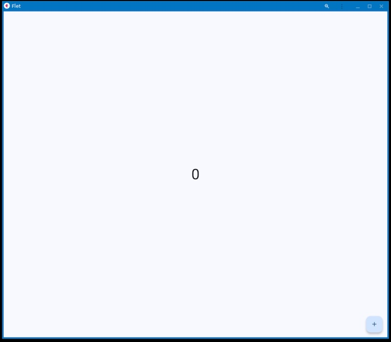
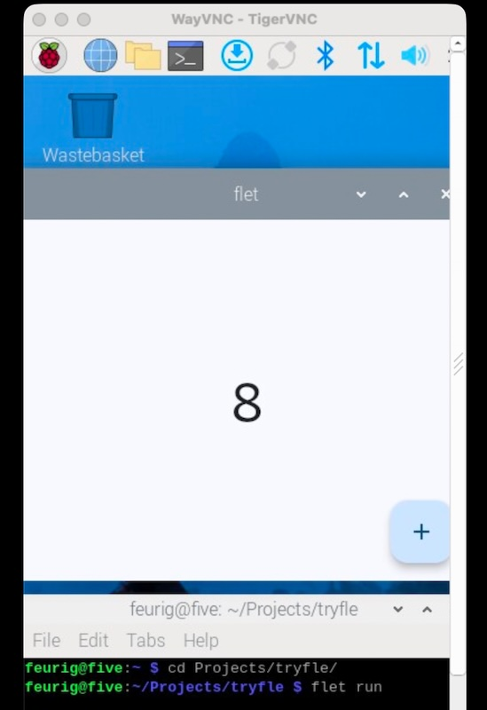

# tryfle A look at flet for building cross platform apps

"DISCLAIMER: This repository contains the test app for a framework called flet and this readme. The readme is also me just trying to see whether or not its worth working with and jotting enough down to come back to it if it is. It is by no means meant to be complete or coherent, just a test case and a running set of notes."

My team lead got all exited about this thing called flet for whipping out python data at a glance (using it as a web app) I had never heard of it but I have spent years developing multiplatform gui applications using wxpython so I thought I would give it a try.

Most of the stuff that follows is based on the default app that you get when you install flet and 'flet create' an app. it is a box with a number and a button that increments it.

## The setup

I created this repository as an empty repository. 
Then I did something similar to the following

```sh
git clone git@github.com:feurig/tryfle.git
cd tryfle
flet create --project-name=hello
git add *
git status
git add pyproject.toml src
git status
git commit -a -m "This is our starting point"
git push
```

## Flet on macos (tahoe)

Installing and trying flet on macos was relatively painless.

### trying flet run on macos

``` sh
git clone git@github.com:feurig/tryfle.git
cd tryfle
flet run
```



Which is pretty damned cool!

### flet build for macos

We are supposed to be able to build binaries so....

```sh
flet build macos -v
```

#### FAILS

flet build uses a pile of google provided ruby named flutter. One of its dependencies is cocoapods. Which doesn't play well with the arcane version of ruby that is still the default on macos tahoe.

And installing ruby 3 or 4 on macos is just a pile.

```sh
sudo gem install cocoapods
gem install ffi -v 1.17.4
sudo gem install ffi -v 1.17.4
# FAILS !!!!
brew install ruby
brew install ruby3
brew install ruby@3.4
type ruby
which ruby
ruby --version
brew install ruby
brew install ruby@3.4
echo "eval $(/opt/homebrew/bin/brew shellenv)" >> ~/.zprofile
eval $(/usr/local/bin/brew shellenv)
# FAILS !!!! then some googles....
brew install rbenv
/usr/local/bin/rbenv install --list-all
brew show ruby
brew info ruby
/usr/local/bin/rbenv install 4.0.0
# FAILS !!!!
/usr/local/bin/rbenv install 3.3.11
# FAILS !!!!
brew install openssl
brew reinstall openssl
/usr/local/bin/rbenv install 4.0.0
# FAILS !!!!
brew reinstall libopenssl
brew info ruby
/usr/local/bin/rbenv install 4.0.3
# FAILS !!!! ...more googles...
brew install openssl@1.1
export RUBY_CONFIGURE_OPTS="--with-openssl-dir=$(brew --prefix openssl@1.1)"\nrbenv install 3.0.6
export RUBY_CONFIGURE_OPTS="--with-openssl-dir=$(brew --prefix openssl@3)"\n\nrbenv install 3.3.3
# FAILS !!!!
```

#### DOH! homebrew has a cocoapods

```sh
brew install cocoapods
brew link --overwrite cocoapods
```

#### Neeto!!!



#### Pushing the mac a little further.

So for fun I found a CC hello world icon  

and replaced the flet one.
The [license with the attribution](src/assets/LICENSE.md) is
is in the repo with under src/assets.

```sh
feurig@pj tryfle % flet build macos -v
[19:39:58] Run subprocess: ['/Users/feurig/flutter/3.41.4/bin/flutter', '--version',
...
╭────────────────────────────────────────────────────────────────────────────────────────────────╮
│ Successfully built your macOS bundle! 🥳 Find it in build/macos directory. 📁                  │
╰────────────────────────────────────────────────────────────────────────────────────────────────╯
feurig@pj tryfle % rm -rf ~/Applications/hello.app
feurig@pj tryfle % mv build/macos/hello.app ~/Applications
```

The flet icon still shows up still shows up in the task bar.
But it looks and feels more like a mac app.



### cross compiling on the mac (FAIL)

I have a few raspberry pi's which have displays and which I plan to embed in various things. Throwing up a nice display quickly is very appealing. So my first thought was to cross compile from the mac to linux. (I knew this was a long shot).

```sh
feurig@pj tryfle % flet build linux --arch=aarch64
[21:55:36]                Build Platform Matrix
           ┏━━━━━━━━━━━━━━━━━━━━━━━━━━┳━━━━━━━━━━━━━━━━━━━━━━━┓
           ┃ Command                  ┃       Platform        ┃
           ┡━━━━━━━━━━━━━━━━━━━━━━━━━━╇━━━━━━━━━━━━━━━━━━━━━━━┩
           │ flet build windows       │        Windows        │
           ├──────────────────────────┼───────────────────────┤
           │ flet build macos         │         macOS         │
           ├──────────────────────────┼───────────────────────┤
           │ flet build linux         │         Linux         │
           ├──────────────────────────┼───────────────────────┤
           │ flet build web           │ macOS, Windows, Linux │
           ├──────────────────────────┼───────────────────────┤
           │ flet build apk           │ macOS, Windows, Linux │
           ├──────────────────────────┼───────────────────────┤
           │ flet build aab           │ macOS, Windows, Linux │
           ├──────────────────────────┼───────────────────────┤
           │ flet build ipa           │         macOS         │
           ├──────────────────────────┼───────────────────────┤
           │ flet build ios-simulator │         macOS         │
           └──────────────────────────┴───────────────────────┘
╭───────────────────────────────────────────────────────────────────────────────────────╮
│ You can't build                                                                       │
╰───────────────────────────────────────────────────────────────────────────────────────╯
```

### cross compiling on debian (FAIL)

Ok so I really don't want to build on an underpowered little device when I have a relatively beefy linux box in the basement. I will spare you the details of installing the toolchain and insane prereqs.

```sh
feurig@nick:~/Projects/tryfle$ PATH=$PATH:/tank/home/feurig/flutter/3.41.4/bin flet build linux --arch=aarch64
[21:46:37] Created app shell ✅
[21:46:38] Packaged Python app ✅
[21:46:44] Customized app icons ✅
[21:46:47] Generated app icons ✅
[21:46:55] Resolving dependencies...
...blah blah blah
           Building Linux application...

           ERROR: Target dart_build failed: Error: Failed to find any of  in
           LocalDirectory: '/usr/lib/llvm-19/bin'
           Build process failed
... more blah blah ... 

╭───────────────────────────────────────────────────────────────────────────────────────╮
│ Error building Flet app - see the log of failed command above.                        │
╰───────────────────────────────────────────────────────────────────────────────────────╯
feurig@nick:~/Projects/tryfle$ ls -lsa /usr/lib/llvm-19/
total 48
 4 drwxr-xr-x  8 root root  4096 Apr 27 14:58 .
 4 drwxr-xr-x 73 root root  4096 Apr 30 16:40 ..
 4 drwxr-xr-x  2 root root  4096 Apr 27 14:57 bin
 4 drwxr-xr-x  4 root root  4096 Apr 27 14:58 build
 0 lrwxrwxrwx  1 root root    14 Jun 14  2025 cmake -> lib/cmake/llvm
 4 drwxr-xr-x  2 root root  4096 Apr 27 14:58 include
20 drwxr-xr-x  6 root root 20480 Apr 27 14:58 lib
 4 drwxr-xr-x  2 root root  4096 Apr 27 14:49 libexec
 4 drwxr-xr-x  8 root root  4096 Apr 27 14:58 share
```

flutter bitches about something that is clearly there.

### compiling on debian (FAIL)

Lets see if it even compiles natively

```sh
feurig@nick:~/Projects/tryfle$ PATH=$PATH:/tank/home/feurig/flutter/3.41.4/bin flet build linux
[20:51:26] Packaged Python app ✅
[20:51:33] Building Linux application...

           ERROR: Target dart_build failed: Error: Failed to find any of  in
           LocalDirectory: '/usr/lib/llvm-19/bin'
           Build process failed
... blah blah blah ...
╭───────────────────────────────────────────────────────────────────────────────────────╮
│ Error building Flet app - see the log of failed command above.                        │
╰───────────────────────────────────────────────────────────────────────────────────────╯
```

NOPE.

### Running on debian

Ok so it wont compile will it run?

#### running on x (FAIL)

The debian machine is a server so we ssh in and X-forward.



#### running on x using 'flet run --web' and google chrome

This more or less works so you can still run it on debian



#### JUST DONT PUSH THE INSTALL BUTTON!

Pushing the install button puts the app in a really nice window where none of the window controls work except for full screan which blacks out most of the screen and wont go back. Maybe it works on a desktop but YUK!!!



### Running on raspberry pi

Since running on the raspberri pi is good enough for our use case we will go there first.



That works!

### compiling on rasberry pi (FAIL)

On a rasberry pi, which is an arm processor, flet installed an intel binary. 

That is gobsmackingly stupid.

```sh
feurig@five:~/Projects/tryfle $ flet build linux --arch=aarch64
[21:27:00] 1 Failed to validate Flutter version.
           Flutter SDK not found or invalid version installed.
(     ●) Initializing linux build...
Flutter SDK 3.41.4 is required. It will be installed now. Proceed?   [y/n] (y): y
[21:27:03]
           /home/feurig/flutter/3.41.4/bin/internal/shared.sh: line 273:
           /home/feurig/flutter/3.41.4/bin/cache/dart-sdk/bin/dart: cannot execute binary
           file: Exec format error
           /home/feurig/flutter/3.41.4/bin/internal/shared.sh: line 273:
           /home/feurig/flutter/3.41.4/bin/cache/dart-sdk/bin/dart: Success

           /home/feurig/flutter/3.41.4/bin/internal/shared.sh: line 273:
           /home/feurig/flutter/3.41.4/bin/cache/dart-sdk/bin/dart: cannot execute binary
           file: Exec format error
           /home/feurig/flutter/3.41.4/bin/internal/shared.sh: line 273:
           /home/feurig/flutter/3.41.4/bin/cache/dart-sdk/bin/dart: Success

╭───────────────────────────────────────────────────────────────────────────────────────╮
│ Error building Flet app - see the log of failed command above.                        │
╰───────────────────────────────────────────────────────────────────────────────────────╯
feurig@five:~/Projects/tryfle $ file /home/feurig/flutter/3.41.4/bin/cache/dart-sdk/bin/dart
/home/feurig/flutter/3.41.4/bin/cache/dart-sdk/bin/dart: ELF 64-bit LSB pie executable, x86-64, version 1 (SYSV), dynamically linked, interpreter /lib64/ld-linux-x86-64.so.2, for GNU/Linux 2.6.32, BuildID[sha1]=a6c2875adfaa96a24e720daaf5261c03f2e7d05f, stripped
feurig@five:~/Projects/tryfle $
```

### Windows
I don't do windows _(unless someone is paying me enough to)_

On the other hand if Windows works as well as the mac I would happily excuse the linux fails since it still works well enough to be useful and there is a lot of windows out there.

If you are a windows dev feel free to pull this repo down and send me an mr or comments with how it went.

## Initial conclusion

It's a mixed bag so far. 

It has its uses. Probably the best of which was the one that my team lead was happy about (html display of columnar data at a glance without having to convert it to a spreadheet). I did go down the rabbit hole of trying to figure out some of the FAILS, but the googles are getting more and more worthless and there is only so much time.

For now, I think it's got a small place in my toolbox. 

## References

https://dev.to/flet/tutorial-build-and-package-a-multi-platform-desktop-app-in-python-3ncc